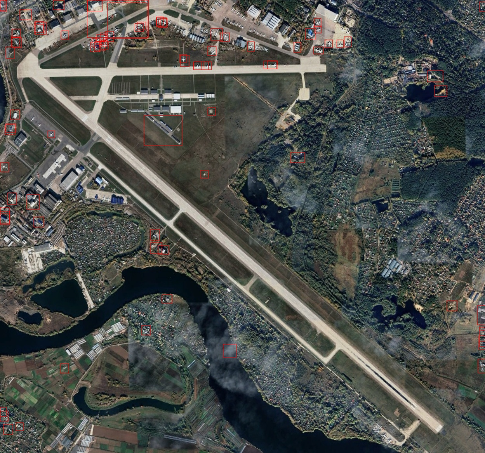

# Детекция аэропортов и самолетов

**Автоматическое обнаружение аэропортов и самолётов на изображениях**

Данный IT-проект был выполнен командой как диплом по ДПО "Методы искусственного интелекта в задачах дистанционного зондирования земли". Проект демонстрирует использование модели YOLOv11 для детекции объектов на оптических спутниковых снимках ДЗЗ.

---

## Table of Contents

- [Цель проекта](#цель-проекта)  
- [Стек используемых технологий](#стек-используемых-технологий)  
- [Структура проекта](#структура-проекта)  
- [Результаты](#результаты)  
- [Метрики](#метрики)  
- [Установка](#установка)  

---

## Цель проекта

Повышение точности и оперативности обнаружения объектов аэродромной инфраструктуры и воздушных судов посредством внедрения моделей глубокого обучения.

Для достижения поставленной цели были проведены исследования: сравнительный анализ форматов спутниковых, обзор современных YOLO-архитектур и изучение методов аугментации и нормализации данных. Основное содержание работы состояло в разработке датасетов для обучения двух моделей YOLO и реализации каскадного алгоритма детекции.

Основными результатами работы, полученными в процессе разработки, являются программное решение с модульной архитектурой, стек технологий на основе Python и PyTorch.

---

## Стек используемых технологий

- Платформы для поиска датасетов:
    - Kaggle 
    - Roboflow 
- Разметка данных:
    - Roboflow
- Обучение моделей:
    - Google Colab  
- Детекция объектов:
    - YOLO

---

## Структура проекта

**Project/**
├── **.gitattributes** — настройки Git LFS для крупных бинарников (.pt)  
├── **.gitignore** — списки файлов/папок, игнорируемых Git  
├── **requirements.txt** — перечень зависимостей Python  
├── **result_work_models_detected/** — итоговые ноутбуки и примеры работы моделей  
│   ├── agg_models.ipynb — сбор результатов разных моделей (каскад моделей)  
│   └── test_work/  
│       ├── predict_image/ — сохранённые изображения с детекцией и JSON-отчет по фотографии  
│       └── image/  
│           └── moscow_test_full_photo.jpg — тестовая картинка для каскада моделей детекции  
├── **airport_detection/** — пайплайн для детекции аэропортов  
│   ├── airport_model_train.ipynb — обучение модели  
│   ├── airport_model_visual.ipynb — визуализация результатов обучения  
│   ├── augm_dataset.ipynb — скрипт аугментации данных  
│   ├── YOLO_detected/ — датасет обучения модели (создается скриптом аугментации)  
│   ├── test_predictions/  
│   │   ├── test_files/ — исходники для тестирования  
│   │   └── predictions/ — предсказанные изображения результатов  
│   ├── source_dataset/ — исходные изображения с разметкой (для аугментации)  
│   │   ├── labels/ — файлы разметки  
│   │   └── images/ — исходные изображения  
│   └── models/  
│       └── airport_yolov11/ — файлы модели: веса, графики, config  
└── **aircraft_detection/** — аналогичный модуль для детекции самолётов  
    ├── aircraft_model_train.ipynb — обучение самолётной модели  
    ├── aircraft_model_visual.ipynb — визуализация результатов  
    ├── YOLO_detected/ — исходные изображения с разметкой  
    └── models/  
        └── aircraft_yolov11/ — файлы модели самолётов  

---

## Пример результатов детекции

Пример детекции аэропортов:


Пример детекции самолетов:



Пример детекции каскада моделей:


---

## Метрики

Распределение разметки датасета детекции аэропортов:


Распределение разметки датасета детекции самолетов:


F1‑Score модели детекции самолетов:


---

## Установка

```bash
git clone https://github.com/Mnogoznaaem/Project.git
cd Project
python -m venv .venv
.venv\Scripts\Activate.ps1      # Windows
pip install -r requirements.txt
```

Дополнительно (если нужны GPU‑ядра в Jupyter/VS Code):

```bash
pip install ipykernel
python -m ipykernel install --user --name=Project --display-name="Python (Project)"
```
